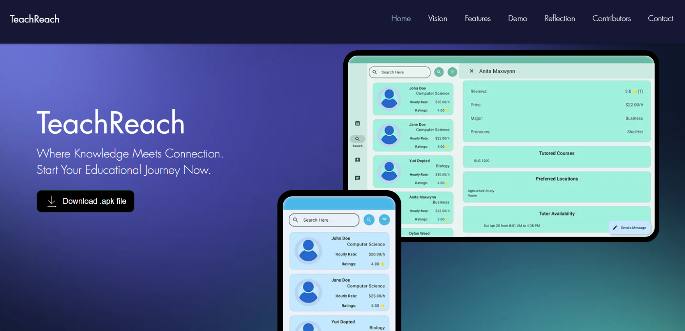

## TeachReach

A platform to connect students easily with tutors!

## Purpose

TeachReach is an Android app that connects students seeking academic help with qualified tutors from
post-secondary institutions. Its primary purpose is facilitating tutoring sessions, allowing
students to find and book sessions with tutors who have excelled in their respective courses. Our
platform supports scheduling tutoring appointments, checking session schedules, handling payments,
and facilitating communications between tutors and students. Tutors can accept or reject tutoring
requests, while tutors and students can manage their schedules and view upcoming sessions on the
platform. TeachReach aims to address the challenges of post-secondary education by enabling students
to select suitable tutors based on detailed profiles and offering tutors a flexible income
opportunity.

## Website

Explore our app presentation on our official website: [TeachReach](https://teachreachdev.wixsite.com/home).

## How to Run TeachReach

### The App:

1. Clone this repository
2. Open with Android Studio
3. Do a Gradle Sync
4. Build the app and run it directly on your device/emulator.

Or you can just install
this [apk](https://umanitoba-my.sharepoint.com/personal/hokt_myumanitoba_ca/_layouts/15/download.aspx?SourceUrl=%2Fpersonal%2Fhokt%5Fmyumanitoba%5Fca%2FDocuments%2Fapp%2Drelease%2Eapk).

### The Tests:

- Unit Tests: Run AllUnitTests.java
- Integration Tests: Run AllIntegrationTests.java
- System (UI) Tests:
    1. Make sure you do not have TeachReach installed on your device
    2. Run AllAcceptanceTest.java

    - Note: If it fails, install the app, clear its storage and cache, then run
      AllAcceptanceTest.java

## Contributing

- [See here](docs/Contributing.md)

## Iteration Progress and Work Analysis

- [Iteration 3](./docs/iteration3ProgressReport.md)

## Retrospective

- [Iteration 1](./docs/RETROSPECTIVE%20-%20ITERATION%201.md)
- [Iteration 2](./docs/RETROSPECTIVE%20-%20ITERATION%202.md)

## Vision Statement

- [Vision Statement](docs/Vision%20Statement.md)

## Architecture

- [Architecture](docs/Architecture.md)

## Coding Style

- [Coding Style](docs/CodingStyle.md)

## Work Flow

- [Our work flow](docs/Contributing.md)
